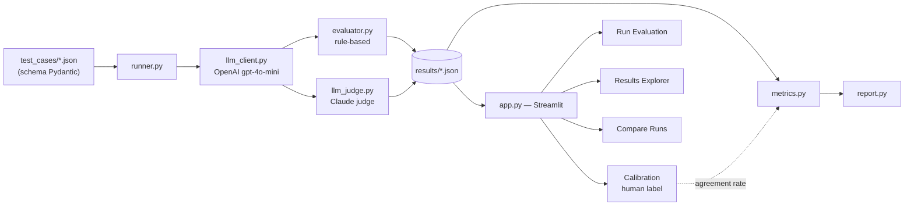

# eval_forge — LLM Evaluation Harness + Internal Platform

Bộ công cụ đánh giá chất lượng output của LLM một cách có hệ thống: chạy test case qua
model cần eval, chấm điểm bằng rule-based evaluator + LLM-as-judge, và xem/so sánh kết quả
qua dashboard nội bộ.

> **Trạng thái hiện tại:** đang ở **Phase 1 — Nền tảng** (mới có cấu trúc dự án, chưa có
> logic thật). Xem tiến độ chi tiết ở [`agent/taskboard.html`](agent/taskboard.html) và
> lịch sử quyết định ở [`agent/AGENT.md`](agent/AGENT.md).

## Vấn đề (Problem statement)

Đánh giá output của LLM "bằng mắt" không scale và không nhất quán. Dùng LLM khác làm judge
thì lại dễ dính **self-preference bias** — model có xu hướng tự đánh giá cao output giống
văn phong của chính họ (hoặc của model cùng họ). Dự án này thử nghiệm một pipeline eval:

- Rule-based evaluator cho các tiêu chí đo được rõ ràng (format, có/không chứa từ khoá...).
- LLM-as-judge **khác họ** với model được test (model test dùng OpenAI, judge dùng Anthropic
  Claude) để giảm — không phải loại bỏ hoàn toàn — self-preference bias.
- Đo lại độ tin cậy của judge bằng **agreement rate với human label** thực tế, thay vì chỉ
  tin lý thuyết.

## Kiến trúc



## Tech stack

| Layer | Công nghệ | Lý do chọn |
|---|---|---|
| Core logic | Python 3.11+ | Nhanh, ecosystem AI mạnh |
| LLM API (model test) | OpenAI API (`gpt-4o-mini`) | Rẻ, đủ để demo |
| LLM API (judge) | Anthropic API (Claude) | Khác họ với model test → giảm self-preference bias |
| Data validation | Pydantic | Ép schema test case, tránh lỗi ngầm khi JSON sai format |
| UI/Platform | Streamlit | Build dashboard nhanh, không cần frontend dev |
| Lưu kết quả | JSON file (`results/*.json`) | Đủ cho scope demo, nâng cấp SQLite nếu cần |
| Phân tích | Pandas | Xử lý bảng kết quả, tính metrics |
| Deploy demo | Streamlit Community Cloud | Có link sống gửi nhà tuyển dụng |
| Secrets | `.env` + `python-dotenv` (local), `st.secrets` (deploy) | Không commit API key |
| Test code | `pytest` (optional) | Test `evaluator.py` không lỗi logic |

## Cấu trúc dự án

```
llm_client.py       # gọi OpenAI API cho model cần eval
evaluator.py        # rule-based evaluator
llm_judge.py         # gọi Claude làm judge, ép JSON output ổn định
runner.py           # nối pipeline: load test case -> model -> evaluate -> judge -> lưu results/*.json
metrics.py          # accuracy, agreement rate, parse_failure_rate
report.py           # xuất báo cáo tổng hợp
app.py              # Streamlit entrypoint (multi-page)
pages/
  run_evaluation.py     # chạy eval từ UI
  results_explorer.py   # xem kết quả
  compare_runs.py        # so sánh pairwise A/B giữa 2 model/run
  calibration.py          # chấm human label, tính agreement rate với judge
test_cases/         # 15-20 test case, 3 category: factual / rag / safety
results/            # output các lần run (không commit *.json, xem .gitignore)
agent/              # tài liệu điều hành: AGENT.md, taskboard.html, contexts/
```

## Cài đặt & chạy (khi code đã hoàn thiện)

```bash
python -m venv .venv && source .venv/bin/activate   # hoặc .venv\Scripts\activate trên Windows
pip install -r requirements.txt
cp .env.example .env   # điền OPENAI_API_KEY, ANTHROPIC_API_KEY
python runner.py       # chạy full test set, kết quả lưu ở results/
streamlit run app.py   # mở dashboard
```

> Lệnh trên mô tả cách chạy dự kiến — `runner.py`/`app.py` hiện mới là stub, xem
> [`agent/taskboard.html`](agent/taskboard.html) để biết phase nào đang làm.

## Sample report & Demo

Sẽ bổ sung sau khi hoàn thành Phase 3 (pipeline chạy được full test set) và Phase 6
(deploy). Chưa có số liệu/link thật ở đây để tránh đưa thông tin chưa xác thực.

- [ ] Sample report (Phase 3)
- [ ] Link demo Streamlit Community Cloud (Phase 6)

## Roadmap

Chia 6 phase, chi tiết task ở [`agent/taskboard.html`](agent/taskboard.html):

1. Nền tảng — cấu trúc dự án, schema test case, 15–20 test case *(đang làm)*
2. Core eval engine — `llm_client`, `evaluator`, `llm_judge`
3. Pipeline hoàn chỉnh — `runner`, `metrics`, `report`
4. Platform hóa — Streamlit: Run Evaluation, Results Explorer
5. Tính năng nâng cao — Compare Runs, Calibration
6. Đóng gói & Demo — README đầy đủ, deploy, insight thật

## License

TBD.
